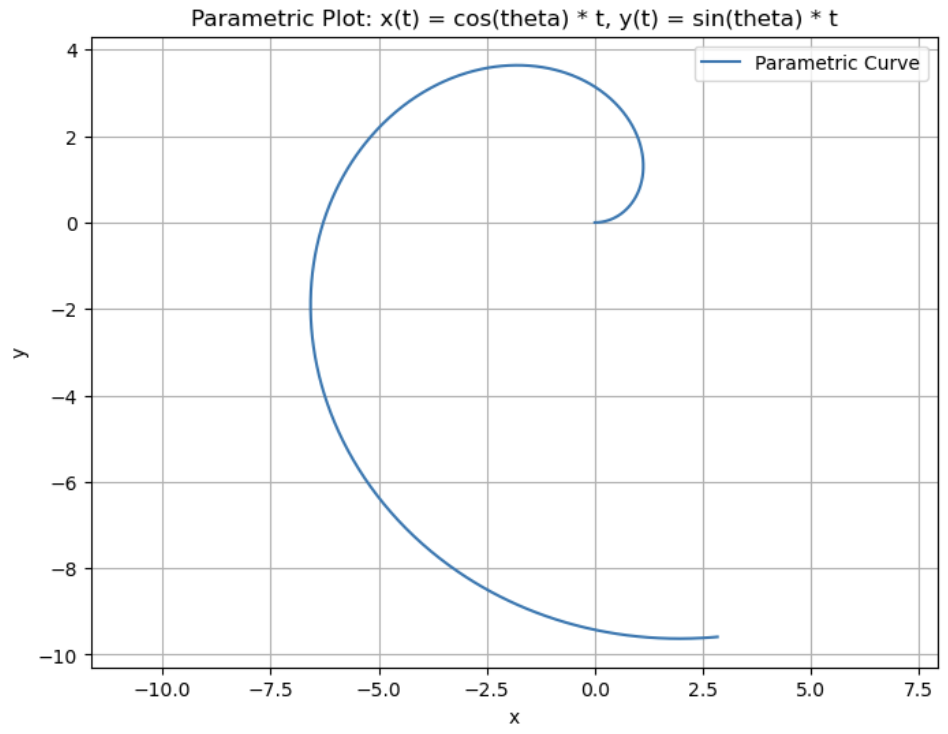

Andrew Chang (andrew51)

### Problem 1

#### Part 1: Solve Diff Eqs

Given: $u = 0.5$ and $\frac{d\theta}{dx} = u$, we know that $\theta = 0.5t$

So, we can directly plug in theta into $\frac{dx}{dt}$ and $\frac{dy}{dt}$
and find the equations for the car's trajectory since v = 1:

$$
x(t) = cos(\theta)*t
$$

$$
y(t) = sin(\theta)*t
$$

#### Part 2: Plot

#### Part 3: Describe path

The path taken by the car follows a spiral trajectory due to the
sinusoidal functions for x and y. Increasing the turning rate would
lead to sharper turns and a tighter spiral

### Problem 2

Is the system asymptotically stable for b = +/−4? Explain why,
considering the eigenvalues of A.

$$
A = \begin{bmatrix} 1 & 4 \\\ -4 & b\end{bmatrix}
$$

Find Eigenvectors

$$
\lvert \begin{bmatrix} 1-\lambda & 4 \\\ -4 & b-\lambda\end{bmatrix}\rvert
$$

$$
16 + (1-\lambda)(b-\lambda) = 0
$$

$$
b - (b+1)\lambda + \lambda^2 +16 = 0
$$

$$
\lambda = \frac{b+1 \pm\sqrt{(b+1)^2 - 4(b+16)}} {2}
$$

When **b = -4**, the eigenvalue has a negative real part so it's **asymptotically stable**

$$
\lambda = \frac{-3 \pm\sqrt{9 - 4(12)}} {2}
$$

When **b = 4**, the eigenvalue has a negative real part so it's **unstable**

$$
\lambda = \frac{5 \pm\sqrt{25 - 4(20)}} {2}
$$

### Problem 3

$$
\begin{bmatrix} \dot x_1 \\\ \dot x_2 \end{bmatrix} =
\begin{bmatrix} 1 & 2 \\\ 2 & 3\end{bmatrix}
\begin{bmatrix} x_1 \\\ x_2 \end{bmatrix} +
\begin{bmatrix} 1 & 0 \\\ 0 & 1\end{bmatrix}
\begin{bmatrix} u_1 \\\ u_2 \end{bmatrix} =
Ax + Bu
$$

$$
\begin{bmatrix} u_1 \\\ u_2 \end{bmatrix} =
-\begin{bmatrix} 2 & k_{12} \\\ 1 & 3\end{bmatrix}
\begin{bmatrix} x_1 \\\ x_2 \end{bmatrix}
$$

$$
u = -Kx
$$

$$
\dot x = [A-Bk]x
$$

$$
A-Bk = \begin{bmatrix} -1 & 2-k_{12} \\\ 1 & 0 \end{bmatrix}

$$

Characteristic Equation

$$
\det[sI - [A-Bk]] = 0
$$

$$
\det \begin{bmatrix}s+1 & -2+k_{12}\\\ -1 & s \end{bmatrix}
$$

$$
s^2 + s -2 + k_{12} = 0
$$

$$
s = \frac {-1 \pm \sqrt{1-4(k_{12}-2)}}{2}
$$

System is stable if s has negative real parts, so **$k_{12} > 2$ returns stable system**
